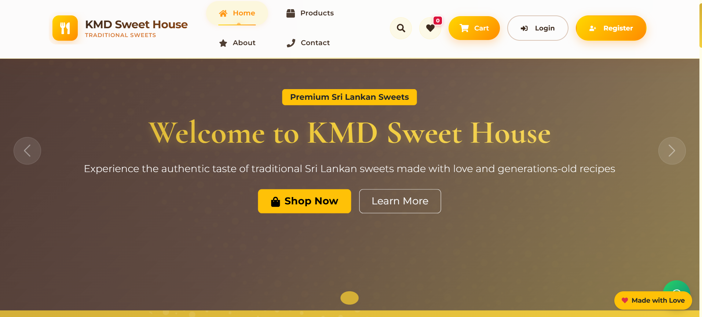
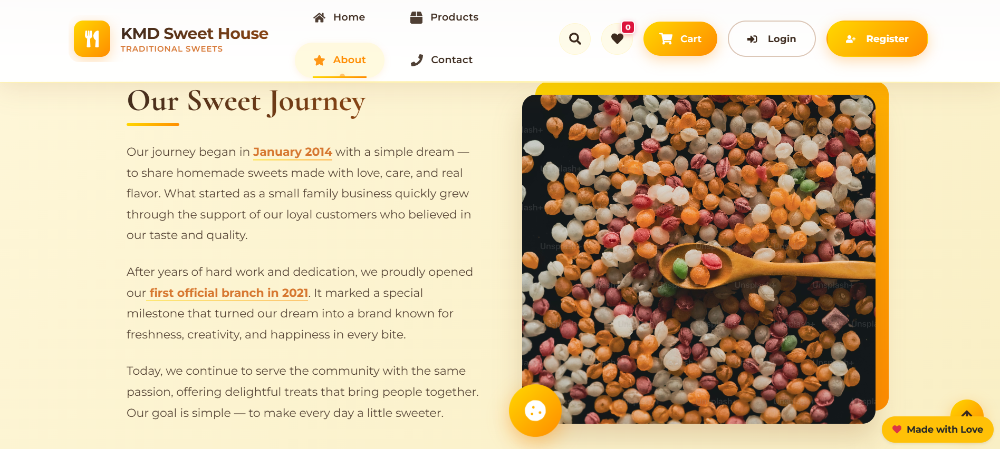
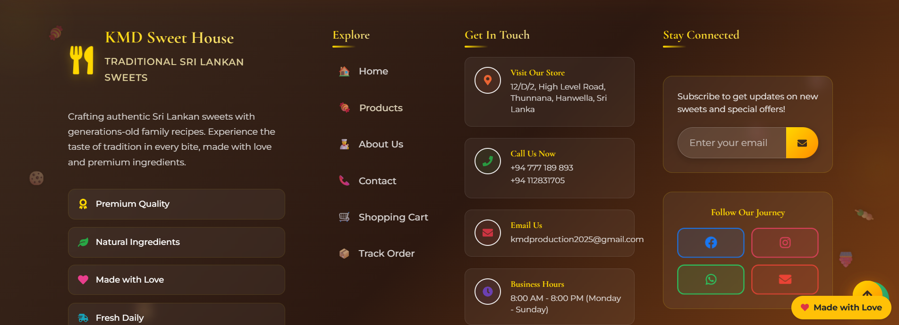

# 🍰 KMD Sweet House Official Website

Welcome to the official repository of **KMD Sweet House** 🎉
A modern, responsive, and user-friendly **React-based web application** designed to showcase sweet products, promotions, and customer engagement features.

---

## 📌 Project Overview

KMD Sweet House website is built to provide a smooth and attractive online experience for customers. It allows users to explore products, view offers, and connect easily with the business.

This system focuses on:

* Better user experience (UX)
* Mobile-first responsive design
* Fast loading performance
* Easy product showcase and navigation

---

## ✨ Key Features

### 🛍️ Product Showcase

* Display sweets with images, price, and details
* Categorized product sections
* Responsive grid layout for desktop and mobile

### 🎞️ Media & UI

* Image slider / carousel system for promotions
* Separate mobile & desktop images
* Attractive banners for deals and featured products

### 🔍 Search & Filtering

* Real-time product search
* Category-based filtering

### 📱 Responsive Design

* Fully optimized for:

  * Mobile 📱
  * Tablet 📲
  * Desktop 💻

### 📞 Contact & Social

* Email and phone contact form
* Social media integration
* Contact section with friendly UI

---

## 🛠️ Tech Stack

* ⚛️ React.js
* 🎨 Tailwind CSS / Bootstrap
* 🔄 Axios for frontend data fetching

---

## 📂 Folder Structure

```
KMD-Sweet-House/
│
├── public/
├── src/
│   ├── components/     # Reusable UI components
│   ├── pages/          # Main pages
│   ├── assets/         # Images, icons, videos
│   ├── services/       # API calls (frontend dummy data)
│   └── App.js
│
├── package.json
└── README.md
```

---

## ⚙️ Installation & Running

### 1️⃣ Clone Repository

```
git clone https://github.com/kavizzz03/KMD_React_Official_Website.git
```

### 2️⃣ Navigate to project

```
cd your-repo
```

### 3️⃣ Install Dependencies

```
npm install
```

### 4️⃣ Start Development Server

```
npm start
```

App will run on:

```
http://localhost:3000
```

---

## 📸 Screenshots & UI




* Responsive product grid
* Hero banners
* Carousel slides
* Contact and social sections

---

## 🤝 Contributing

Contributions are welcome!

Steps:

1. Fork the repository
2. Create a new branch
3. Make changes to the frontend UI or components
4. Submit a Pull Request

---

## 📞 Contact

* 👤 Name: Kavindu Bogahawatte
* 📧 Email: [kavindumalshan2003@gmail.com](mailto:kavindumalshan2003@gmail.com)
* 📱 Phone: +94740890730

---

## ⭐ Support

If you like this project, please give it a ⭐ on GitHub and share it!

---

## 📜 License

This project is licensed under the MIT License.

---

💖 Developed with passion by **Kavindu Bogahawatte / KMD Sweet House Team**
